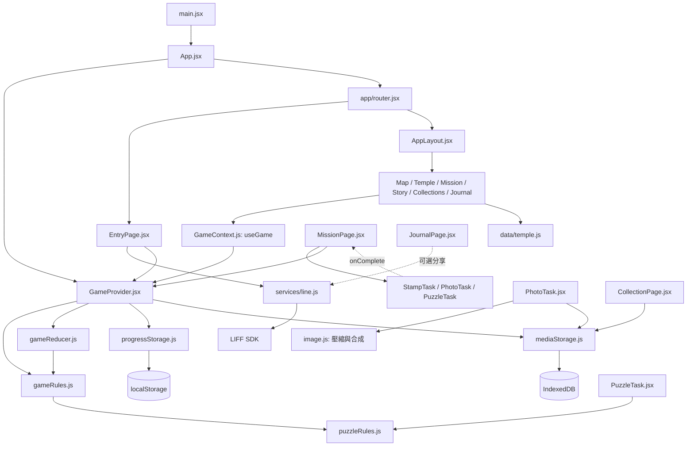
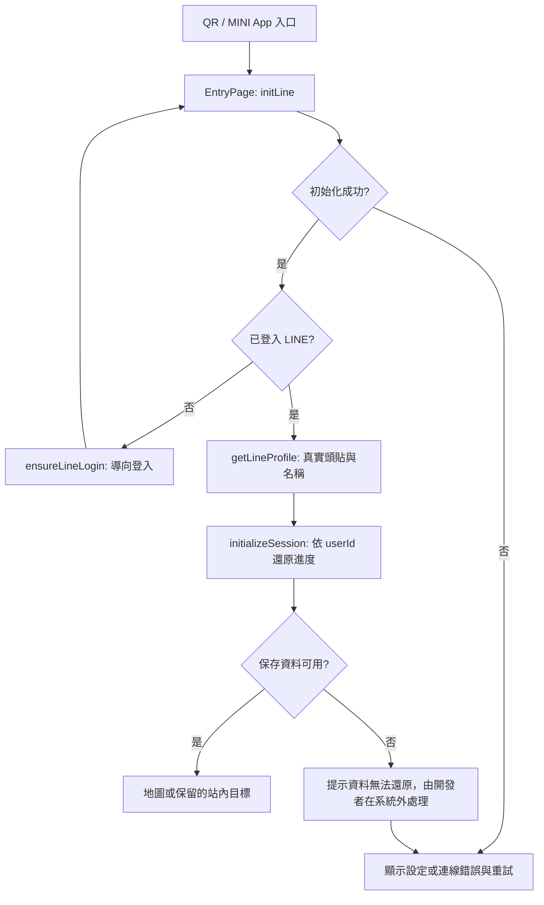
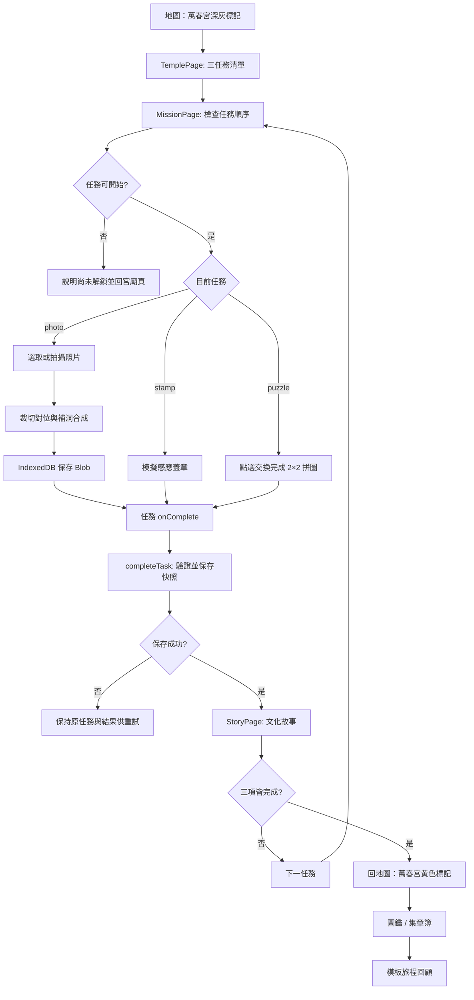
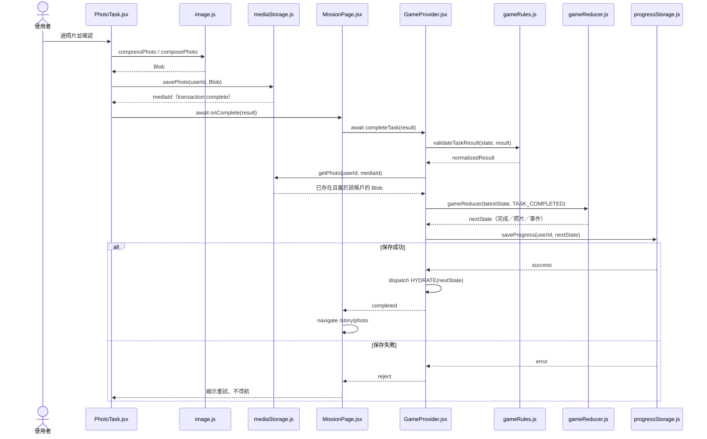

# 萬春宮 DEMO：檔案、函式與系統流程規格

本文件是待實作規格，不代表下列程式檔已建立。對應 2.5 天四人計畫；A＝經驗較豐富的資管三、B＝另一名資管三、C/D＝兩名資管二。JS/JSX + React Router + Context/useReducer；僅單一萬春宮點位，地圖為靜態 SVG。沿用現有 main.jsx、App.jsx，不另外建立第二套入口。錄影、截圖與展示前資料準備皆在系統外處理，不開發錄影工具或進度重置功能。

## 1. 明確檔案樹

```text
lineAI/
├─ docs/
│  ├─ architecture.md               長期架構
│  ├─ demo-plan.md                  時程、分工與影片腳本
│  └─ demo-file-spec.md             本規格
└─ my-react-app/
   ├─ package.json                  [A] 套件與 dev/build/lint 指令
   ├─ package-lock.json             [A] npm 依賴版本，由 npm 產生
   ├─ .env.example                  [A] 公開環境變數範本
   ├─ .gitignore                    [A] 排除 .env.local、dist、node_modules
   ├─ index.html                    [A] root 與手機 viewport
   ├─ vite.config.js                [A] React 建置設定
   ├─ eslint.config.js              [A] JS/JSX 靜態檢查設定
   ├─ vercel.json                   [A/B] SPA 路由 fallback
   ├─ public/demo/
   │  ├─ map.svg                    [C] 地圖底圖，標記座標依此固定
   │  ├─ temple.jpg                 [D] 萬春宮介紹圖
   │  ├─ photo-target.jpg           [B/D] 拍照目標圖
   │  ├─ puzzle.jpg                 [D] 拼圖圖案
   │  ├─ stamp.png                  [C] 數位章圖
   │  └─ progress-examples.png       [C] 其他行政區色彩示意
   └─ src/
      ├─ main.jsx                   [A] React 唯一掛載入口
      ├─ App.jsx                    [A] 組合 Provider 與 Router
      ├─ app/
      │  ├─ router.jsx              [A] 路由表、登入保護
      │  ├─ AppLayout.jsx           [C] 標題列、頭貼、底部導航
      │  └─ EntryPage.jsx           [A] LINE 初始化、讀取進度與重試
      ├─ config/
      │  ├─ env.js                  [A] 讀取及檢查公開環境設定
      │  └─ routes.js               [A] 路由路徑常數，避免與元件混合匯出
      ├─ data/
      │  └─ temple.js               [A；D 提供內容] 唯一點位、任務與故事資料
      ├─ state/
      │  ├─ GameContext.js          [A] context 與 useGame hook
      │  ├─ GameProvider.jsx        [A] 共用狀態與保存操作
      │  ├─ gameReducer.js          [A] 純狀態轉換
      │  └─ gameRules.js            [A] 任務順序、完成條件及選取函式
      ├─ services/
      │  ├─ line.js                 [A] LIFF 包裝；可選分享
      │  ├─ progressStorage.js      [A] localStorage 快照與版本處理
      │  ├─ mediaStorage.js         [B] IndexedDB 圖片 Blob 保存
      │  └─ image.js                [B] 照片壓縮與遮罩合成
      ├─ features/
      │  ├─ map/
      │  │  └─ MapPage.jsx          [C] 地圖、萬春宮標記與示意圖
      │  ├─ temple/
      │  │  └─ TemplePage.jsx       [C] 宮廟介绍與三任務入口
      │  ├─ missions/
      │  │  └─ MissionPage.jsx      [A] 鎖定檢查、任務切換、提交結果
      │  ├─ stamp/
      │  │  └─ StampTask.jsx        [C] 模擬感應與蓋章呈現
      │  ├─ photo/
      │  │  └─ PhotoTask.jsx        [B] 選取／拍攝、預覽、補洞、保存
      │  ├─ puzzle/
      │  │  ├─ PuzzleTask.jsx       [D] 2×2 點選交換拼圖
      │  │  └─ puzzleRules.js       [D] 拼圖陣列與成功判定
      │  ├─ story/
      │  │  └─ StoryPage.jsx        [D] 文化故事、下一步與返回
      │  ├─ collection/
      │  │  ├─ CollectionPage.jsx   [C] 照片圖鑑與取得時間
      │  │  └─ StampBookPage.jsx    [C] 數位章與取得時間
      │  └─ journal/
      │     └─ JournalPage.jsx      [D] 模板式旅程時間線
      ├─ components/
      │  └─ AsyncStatus.jsx         [C] loading/error/retry 共用顯示
      ├─ utils/
      │  └─ formatTime.js           [C] 台灣時間顯示
      └─ styles/
         └─ global.css             [C] 色票、間距、layout、手機樣式
```

樣式以單一 global.css 起步，feature 類別加前綴（photo-、puzzle- 等）避免衝突；不要求每個元件新增獨立 CSS 檔。原 Vite 範例 App.css/index.css 與標誌於實作時清理，避免舊樣式影響手機版。

## 2. 每個程式檔應包含的函式

函式名稱為共用約定；表中的元件函式即 JSX 元件。只有真正異步的 I/O 使用 Promise。設定、資產檔不需要函式。

### 入口、路由與設定

| 檔案 | 函式／匯出 | 主要責任 |
| --- | --- | --- |
| main.jsx | createRoot(...).render(...) | import global.css，掛載 StrictMode/App |
| App.jsx | App() | 組合 GameProvider 與 RouterProvider |
| app/router.jsx | router；RequireReady()（路徑常數見 config/routes.js） | 建立路由表；尚未登入或還原時導回入口，保留站內目標網址 |
| app/AppLayout.jsx | AppLayout() | 顯示 profile、底部 Link、Outlet；不保存遊戲進度 |
| app/EntryPage.jsx | EntryPage()；startSession()；handleRetry() | 初始化 LIFF → getProfile → initializeSession → 導向地圖或原站內網址；處理 error 與重試 |
| config/env.js | readEnv() → { liffId, authMode } | 檢查 VITE_LIFF_ID、VITE_AUTH_MODE；LINE 模式缺 ID 要報錯，不默默改用假帳號 |
| data/temple.js | TEMPLE；TASKS；STORIES；DEMO_CONTENT_VERSION | 常數，不存玩家狀態；素材、照片遮罩、拼圖設定、故事來源都放這裡 |

路由：/ 入口；/map；/temple/wanchun；/mission/:taskId；/story/:taskId；/collection；/stampbook；/journal。受保護頁面放在 AppLayout 下。不存在的 ID 顯示「找不到任務」並回地圖；路由參數不是信任來源。

### 共用狀態與規則

| 檔案 | 函式／匯出 | 主要責任 |
| --- | --- | --- |
| state/GameContext.js | GameContext；useGame() | 提供 hook；在 Provider 外使用就拋明確錯誤。與 Provider 分檔，避免 React refresh 匯出混用問題 |
| state/GameProvider.jsx | GameProvider({children}) | useReducer、ready/profile、保存錯誤與提交中的 UI 狀態 |
| 同上 | initializeSession(profile) → Promise<void> | 使用當次 userId 讀取快照，處理未知版本／壞資料，再將 session 設為 ready |
| 同上 | completeTask(result) → Promise<{status,nextTaskId,templeCompleted}> | 序列化提交、驗證、純 reducer 建快照、保存成功後發布狀態；status 為 completed 或 alreadyCompleted |
| state/gameReducer.js | createInitialState()；gameReducer(state,action) | 處理 HYDRATE、TASK_COMPLETED；TASK_COMPLETED 再檢查前置條件及去重；不存取瀏覽器 API、不發 API、不產生時間或亂數 |
| state/gameRules.js | getTask(taskId)；getTaskStatus(state,taskId) | 找設定、推導 locked/available/completed；未知 ID 不能通過 |
| 同上 | validateTaskResult(state,result) → normalizedResult | 檢查 taskId、kind、順序、結果格式；stamp 必須 mockTouchConfirmed、photo 必須 mediaId、puzzle 必須符合拼圖終局。正式驗證仍需後端 |
| 同上 | getNextTaskId(state)；isTempleComplete(state) | 決定下一項；三項全部完成才點亮 |
| 同上 | selectMapStatus(state)；selectJournalEvents(state) | 取得 dark/yellow 錨點狀態、依時間排序的事件；行政區色彩僅用靜態示意 |

completeTask 要在同一處完成收藏與旅程事件，不讓三個任務各自修改收藏。使用同步 ref 鎖與最新狀態 ref 防止快速連按、閉包舊值和 concurrent 提交；只 dispatch 不足以讓下一行立即讀到新 state。

### LINE 與儲存服務

| 檔案 | 函式／匯出 | 主要責任 |
| --- | --- | --- |
| services/line.js | initLine() → Promise<void> | 單一 initPromise 包裝 liff.init，防 StrictMode 重複初始化 |
| 同上 | ensureLineLogin(returnPath) → {redirecting:boolean} | 檢查 liff.isLoggedIn；需要時 liff.login，使用 endpoint 範圍內的返回地址；不在每個頁面重複呼叫 |
| 同上 | getLineProfile() → Promise<Profile> | 正規化 userId/displayName/pictureUrl；只作 DEMO profile 與本機命名空間，不作正式獎勵授權 |
| 同上 | shareJourney(summary) → Promise<{status}> [P1] | API 可用才呼叫 shareTargetPicker；區分 sent/cancelled/unavailable；只在點擊分享時執行 |
| services/progressStorage.js | makeProgressKey(userId) | 產生 wanchun-demo:v1:<userId>，不混用他人的快照 |
| 同上 | loadProgress(userId) → snapshot/null | JSON 解析、schema/content version、形狀驗證；損壞時回報 recoverable error |
| 同上 | saveProgress(userId,snapshot) | 小型進度快照寫入，quota/security error 不可吞掉 |
| services/mediaStorage.js | openMediaDb() → Promise<IDBDatabase> | 建立 media object store，含 ownerId 索引 |
| 同上 | savePhoto(userId,blob) → Promise<mediaId> | 以 ownerId 保存，等 transaction complete 才算成功 |
| 同上 | getPhoto(userId,mediaId) → Promise<Blob/null> | 確認擁有者再讀取 |
| 同上 | deletePhoto(userId,mediaId) | 重新拍攝時清理未提交的照片 |
| services/image.js | validateImageFile(file) | 檢查格式、容量及是否可解碼；不只檢查副檔名 |
| 同上 | compressPhoto(file,{maxEdge,quality}) → Promise<Blob> | 縮小圖片，降低手機儲存與合成負擔 |
| 同上 | composePhoto({targetBlob,userBlob,crop,maskRect}) → Promise<Blob> | Canvas 對位裁切後，僅在指定矩形缺口繪製使用者照片；回傳合成照片 |
| utils/formatTime.js | formatTaipeiTime(isoString) → string | Intl.DateTimeFormat、Asia/Taipei，無效值顯示安全文字 |

.env.example：VITE_LIFF_ID、VITE_AUTH_MODE=line。開發可明確選 mock，但影片必須用 line，且 UI 顯示目前模式。所有 VITE_* 都公開；不放 channel secret、AI key、SMS 憑證。vercel.json 負責非靜態資源頁面的 SPA fallback，實作時檢查直接開 /mission/photo 的結果。

### 各功能頁面與任務

| 檔案 | 函式 | 主要責任 |
| --- | --- | --- |
| map/MapPage.jsx | MapPage()；handleTempleClick() | 讀取 selectMapStatus、顯示 map.svg 與標記、導向宮廟頁；無 geospatial 邏輯 |
| temple/TemplePage.jsx | TemplePage()；handleStartTask(taskId) | 讀取 TEMPLE/TASKS 與狀態；可開始才導航，顯示已完成與鎖定 |
| missions/MissionPage.jsx | MissionPage()；handleComplete(result) → Promise<void> | 檢查路由與任務權限；依 ID 渲染三任務之一；await completeTask 後前往 story；保存失敗停在任務頁 |
| stamp/StampTask.jsx | StampTask({onComplete})；handleMockTouch() | 顯示「模擬感應」；回傳 stamp 結果；提交期間停用按鈕，成功後動畫只是視覺效果 |
| photo/PhotoTask.jsx | PhotoTask({onComplete})；handleFileChange(event) | input accept=image/* capture=environment；相簿可作備援；驗證／壓縮與預覽 |
| 同上 | handleCropChange(crop)；handleConfirm()；clearPreview() | 對位 → 合成 → savePhoto → await onComplete；提交失敗保留照片供重試，重新拍攝才清理舊媒體；object URL 在更換／unmount 釋放 |
| puzzle/PuzzleTask.jsx | PuzzleTask({imageUrl,onComplete})；handleTileClick(index)；handleSubmit() | 選兩片交換，拼完才允許確認；提交最終 tileOrder；停用提交中的操作 |
| puzzle/puzzleRules.js | createStartingTiles()；swapTiles(tiles,a,b)；isSolved(tiles) | 2×2 以固定未完成陣列起步（如 [1,0,2,3]），交換回傳新陣列，檢查 [0,1,2,3] |
| story/StoryPage.jsx | StoryPage()；handleContinue() | 只允許看已完成任務的故事；下一任務或全部完成後返回地圖 |
| collection/CollectionPage.jsx | CollectionPage()；loadPhotoPreview(record) | 用 getPhoto 取得 Blob/object URL；缺圖顯示補拍提示，不宣稱完成圖片可用；清理 URL |
| collection/StampBookPage.jsx | StampBookPage() | 印章圖片、宮廟名、取得時間、空狀態 |
| journal/JournalPage.jsx | JournalPage()；buildTimeline(events)；handleShare() [P1] | 固定模板呈現蓋章／照片／拼圖事件；標示「模板手札」；無 AI 呼叫 |
| components/AsyncStatus.jsx | AsyncStatus({status,message,onRetry}) | loading/error/empty 共用 UI；重試交回父層 |

事件處理函式可寫在元件內，不必全部 export；僅元件、純規則、服務介面需要匯出。StoryPage 無需重複 completeTask，避免觀看故事又新增完成紀錄。

## 3. 四人先共同確認的資料格式

```js
// data/temple.js
TEMPLE = {
  id: 'wanchun', districtId: 'taichung-central-demo',
  name: '萬春宮', mapAnchor: { xPercent: 50, yPercent: 50 },
  imageUrl: '/demo/temple.jpg', // 點位為示意版圖上座標，非真實經緯度
}
TASKS = [
  { id: 'stamp', order: 1, type: 'stamp', storyId: 'stamp-story' },
  { id: 'photo', order: 2, type: 'photo', storyId: 'photo-story' },
  { id: 'puzzle', order: 3, type: 'puzzle', storyId: 'puzzle-story' },
]

// 記憶體 session 與玩家進度分開；profile 不寫入進度快照
session = { status: 'loading', profile: null, error: null }
progress = {
  schemaVersion: 1, contentVersion: 'wanchun-demo-1',
  missionCompletions: {}, // keyed by stamp/photo/puzzle
  stampRecords: [], photoRecords: [], journalEvents: [],
}

// 共用 callback：任務只送候選結果，Provider 最終確認
result = {
  taskId: 'photo', completedAt: '2026-09-18T02:00:00.000Z',
  evidence: { kind: 'photo', mediaId: 'generated-media-id' },
}
// stamp evidence: { kind: 'stamp', mockTouchConfirmed: true }
// puzzle evidence: { kind: 'puzzle', tileOrder: [0,1,2,3] }
// Provider 正規化時間；DEMO 本機時間，不能當正式權益證據。

// 承接舊計畫中的 result.mediaId 時，先由 MissionPage 統一轉換成 evidence；
// 新開發一律採本文件格式，不讓兩套格式在 reducer 中並存。
```

已完成結果重複送出，回傳 alreadyCompleted，不新增章、照片或事件。若選了新照片再重複提交，未使用媒體要清理。未完成結果送出時，Provider 確認 mediaId 屬於當前 userId 且可讀；純 reducer 只驗證形狀及前置條件。

收藏 ID／事件 ID 由固定 taskId 推導（stamp:wanchun、photo:wanchun、event:stamp 等），不在 reducer 內 randomUUID。媒體 ID 由 mediaStorage 產生。

## 4. 檔案間的連接圖

箭頭表示呼叫／依賴。畫面讀狀態透過 useGame，任務元件成功回呼 MissionPage；不自行 dispatch。



禁止反向依賴：services 不 import React 元件／Provider；gameRules 不操作儲存或導航；data 不讀 session；子任務不直接寫進度。圖中 Rules → puzzleRules 是允許的純規則依賴，避免兩套成功判定。

## 5. 啟動與 LINE 系統流程



回傳網址只接受白名單站內路徑，不接受任意外站。EntryPage 啟動 effect 使用取消旗標避免 unmount 後導航；init/session 操作需可重複執行而不新增事件。profile 不等同正式 token 驗證，本次無真實獎勵。

## 6. 遊戲主流程



本次不根據萬春宮一點完成就將真實中區或台中市計為全區完成。色彩政策用示意截圖呈現，無 LINE POINTS 發放動作。

## 7. 拍照成功的檔案呼叫時序



IndexedDB 圖片保存與 localStorage 快照不是原子交易；先保存照片再保存快照，失敗保留照片供本次重試，重新拍攝時再清理未使用的照片。若瀏覽器清掉照片，圖鑑應顯示缺圖提示。未來正式版再由後端交易與媒體服務承接。

## 8. 開工順序與整合驗收

1. A 先建立 state/data/空路由與三個 callback stub；B 建 LINE Console；C/D 準備素材。
2. A/B 完成真實 LINE 入口；C 的 Map/Temple/Stamp 與 D 的 Puzzle/Story 可用假 props 獨立開發。
3. 第一輪接 Stamp + Puzzle；B 完成 Photo 及媒體介面後再接照片。
4. C/D 從 useGame 讀收藏／事件完成圖鑑、集章、回顧；禁止另存一套完成進度。
5. 跑 lint/build 與實機三任務；第二天凍結後錄影。

整合最低驗收：直接開 /mission/puzzle 不能跳關；蓋章連按不能重複；取消照片不算成功；圖片保存失敗不通關；拼圖未完成不通關；刷新還原；LINE 真實模式不退成 mock；三任務完成後地圖變黃；照片和章有取得時間。

這份函式介面優先於 demo-plan.md 早期較簡略的 callback 範例；本次不需要建立長期架構中的全套 repositories、AI adapter 或 reward service。
