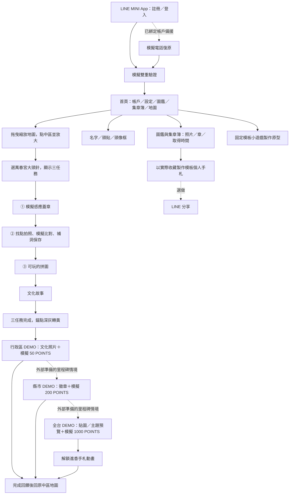
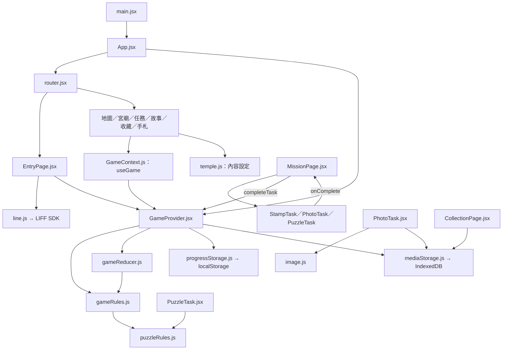
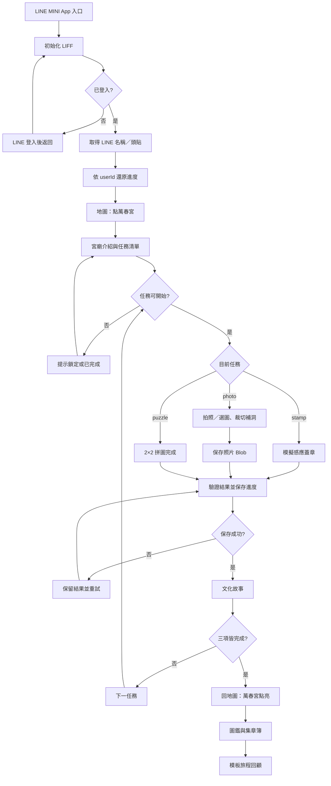

# 萬春宮文化探索 DEMO：專案指南

本專案以智慧宮廟與文化宣傳為主軸，透過 LINE 入口串聯數位蓋章、拍照及文化小遊戲。此次採前端 React + JavaScript，展示地點為台中市中區萬春宮，開發時間約 2.5 天。

**目前狀態：環境已建置、程式骨架已建立；LINE 串接及完整遊戲流程尚未完成。** 本文中的流程圖與函式表是實作規格，不代表功能已可使用。

## 1. MVP 功能範圍與完整 DEMO 旅程

MVP 覆蓋原始構想的完整使用者旅程：登入與驗證 → 全台地圖 → 行政區與宮廟 → 三項順序任務 → 故事與點亮 → 行政區／縣市／全台里程碑 → 收藏與個人化手札。萬春宮是主要實際操作點位；大範圍進度、AI 與外部權益可用明確標示的模擬資料展示，不要求在 2.5 天內完成正式服務。

以下是新增的 MVP 目標，尚未代表程式已實作。此次只擴充本節；後續章節仍保留先前精簡版本的檔案、分工及流程設計，尚未同步增加新功能。

### 1.1 入口、驗證與遊戲首頁

| 功能 | 可展示的行為 | 真實／模擬邊界 |
| --- | --- | --- |
| LINE MINI App 入口 | 從 LINE 入口開啟 Vercel HTTPS 網頁，完成 LIFF 初始化 | 真實串接；需團隊設定 channel、endpoint 與 LIFF ID |
| LINE 註冊／登入 | 首次登入顯示註冊同意流程，再帶入 LINE 名稱與頭貼；再次進入還原進度 | LINE profile 真實取得，遊戲帳戶先在本機建立，尚無後端 token 驗證 |
| 雙重驗證 | 登入後顯示電話輸入、驗證碼、錯誤提示及通過畫面 | 示意 OTP，不發送 SMS；清楚標示模擬，不能聲稱已驗證電話所有權 |
| 電話備援 | 提供已綁定 LINE 帳戶的電話復原流程與成功／失敗結果 | 以示意資料演示；正式帳戶仍強制綁定 LINE，無其他社群登入，不用電話建立獨立帳戶 |
| 遊戲首頁 | 顯示帳戶、設定、圖鑑、集章簿入口，中間放台灣地圖 | 可操作頁面；優先確保手機版主要按鈕可點 |
| 帳戶設定 | 修改遊戲內名字、選取頭貼、更換預設頭像框，显示 LINE 綁定狀態 | 本機保存；不修改使用者 LINE 本身的姓名或頭貼 |
| 一般設定 | 音效與動畫開關等少量設定 | 開關需有對應效果；不加入錄影工具或進度重置 |

### 1.2 全台地圖、行政區與宮廟

| 功能 | 可展示的行為 | 簡化方式 |
| --- | --- | --- |
| 台灣地圖 | 預設淺灰，可拖曳移動與縮放 | 採簡化 SVG／圖片容器變換，非完整 GIS 或高精度全台行政區資料 |
| 選取行政區 | 點選台中市中區示意區塊，地圖以該區為中心放大 | 中區為主要可操作區；其他行政區可展示外部準備的截圖 |
| 宮廟錨點 | 放大後顯示大頭針式萬春宮標記，點開介紹與任務 | 萬春宮為真實地點；版面標記若未使用真實座標應視為示意 |
| 任務入口 | 顯示蓋章、拍照、小遊戲三項任務，以及鎖定／可開始／已完成狀態 | 三項實際可依序操作；不能只靠切換畫面假裝通關 |
| 地圖進度色彩 | 錨點深灰 → 黃；行政區未完成淺灰、至少一個宮廟完成淺黃、全部完成橘色 | 萬春宮錨點實際隨進度更新；其他行政區色彩以外部截圖展示，不新增示意進度控制頁 |

「全部完成」以活動納入的點位為分母。DEMO 只含萬春宮時，畫面寫「中區 DEMO 活動路線完成」，不能宣稱已完成真實中區所有宮廟；沒有點位的區域不得自動通關。

### 1.3 宮廟三項順序任務

| 任務 | 可展示的完整操作 | 簡化與完成條件 |
| --- | --- | --- |
| ① 數位蓋章 | 顯示實體假印章／NFC 的使用說明 → 模擬感應 → 蓋章動畫 → 印章加入集章簿並記錄時間 | 有正式 LINE Touch 硬體時可展示入口；否則 QR／普通 NFC 作開啟原型，蓋章驗證標示模擬。完成後才解鎖拍照 |
| ② 找點拍照 | 顯示部分挖空的宮廟照片 → 在現場找位置 → 拍攝／選圖 → 對位裁切 → 顯示相似度結果 → 把缺口補上 → 保存照片 | 相似度採明示的模擬結果；實際完成圖片選取、合成及保存。不符合示意門檻或使用者取消時可重試；成功後才解鎖小遊戲 |
| ③ 互動小遊戲 | 開啟固定模板 → 操作 → 成功回饋 → 顯示相關文物、宮廟或神祇故事 | 至少一款真正可玩的 n×n 拼圖（先用 2×2）；成功判定由碎片位置決定，不用任意按鈕直接通關 |
| 其他小遊戲構想 | 展示石柱碎片修補、區域填色、文物保存／修復的玩法預覽及範例完成畫面 | 非主線模板可用靜態規則與範例互動畫面標示原型，不要求每款完整實作 |
| 文化故事 | 小遊戲成功後呈現短故事、圖片及來源，讀完可回地圖 | 示意題庫；文化敘述保留來源。前兩項可附簡短文化提示 |

主線三項完成後，萬春宮錨點點亮，結果保存。一般完成回到原中區地圖視角；若同時解鎖里程碑，先播放完成回饋再回地圖。動畫與資料保存分離，重新整理不重複增加收藏。

### 1.4 行政區、縣市與全台完成獎勵

以下三個層級都要有可展示的結果畫面，包含取得內容、數量及完成回饋。大範圍成果採外部準備的 DEMO 情境資料，不要求真的走遍台灣，也不建立錄影用重置或快速通關介面。

| 層級 | 原構想獎勵 | DEMO 展示方式 |
| --- | --- | --- |
| 鄉鎮市區完成 | 一張當地文化／歷史照片收入圖鑑，50 LINE POINTS | 中區 DEMO 路線完成卡、經授權的文化照片與圖鑑新增紀錄；50 POINTS 顯示為模擬獎勵 |
| 縣市完成 | 遊戲內紀念徽章，額外 200 LINE POINTS | 台中市 DEMO 里程碑畫面、徽章在帳戶可見；200 POINTS 為模擬獎勵 |
| 全台完成 | 解鎖進香旅程手札動畫、紀念 LINE 永久貼圖與永久主題，額外 1000 LINE POINTS | 全台 DEMO 成就畫面、可播放旅程動畫、貼圖／主題預覽及 1000 POINTS 模擬獎勵 |

模擬 POINTS 不放入真實 LINE 錢包；永久貼圖與主題不實際發送或安裝。預覽與獎勵畫面必須標示「DEMO 模擬／待正式合作」。不同層級獎勵為額外獎勵，不能重複點擊領取。同次達成多層里程碑時，依行政區 → 縣市 → 全台順序顯示回饋，最後回原行政區地圖。

### 1.5 圖鑑、集章簿與 AI 手札

| 功能 | 可展示的行為 | 簡化方式 |
| --- | --- | --- |
| 圖鑑 | 查看任務合成照片、拍攝照片及行政區獎勵文化照片；點入可看地點、說明與取得時間 | 萬春宮任務照片真實保存；獎勵照片需使用具來源／授權素材，歷史圖不足時用已註明的替代照片 |
| 集章簿 | 查看數位印章、宮廟名、取得時間，包含未取得的空格 | 由蓋章完成紀錄生成，不另外維護一套進度 |
| 使用者專屬旅程手札 | 按下製作 → 顯示生成中 → 產生包含名字、時間、照片、章及故事的個人化手札 | 先用固定模板模擬 AI 服務，畫面標示模板／模擬生成；內容需引用當前玩家實際收藏 |
| 全台手札動畫 | 一條時間線由左向右延伸，顯示里程碑、大型宮廟回憶節點、照片及印章 | 可使用少量示意節點與 CSS 動畫；實際取得節點與預設示意節點需可區分 |
| LINE 分享 | 主動點擊分享手札摘要／完成卡片，選擇測試好友或群組 | 選做真實 LIFF 分享；取消、API 不可用不影響主線完成 |
| AI 固定框架遊戲製作 | 選拼圖等模板及難度 → 顯示製作中 → 產生遊戲設定預覽；拼圖模板可進入試玩 | 規則式／預設 JSON 模擬生成設定，標示非真實 AI；不執行生成的程式碼，不更改主線通關紀錄 |
| AI 圖片相似度 | 拍照後顯示比對中、示意分數、成功／重拍結果 | 置於拍照任務內演示；不宣稱模型已能辨識現場位置 |

### 1.6 完整 DEMO 流程與驗收



最低要求是原流程每個環節都有可呈現的畫面或操作，不是只有文字列出未來功能。LINE 入口／profile、三任務順序、照片處理、至少一款小遊戲、收藏與返回地圖要真正可操作；驗證、AI、外部獎勵與全台進度允許明確模擬。其他行政區色彩仍可在系統外用截圖呈現。

2.5 天內先完成真實 LINE 與萬春宮主線，再補帳戶、收藏、模板手札及各層成果畫面，最後補電話驗證、遊戲製作與其他模板的簡化原型。這個擴充目標比原精簡版更大，優先簡化介面及動畫，避免因外部服務串接阻礙完整旅程展示。

## 2. 檔案架構與功能

此樹列出已存在的主要檔案。素材 JPG/PNG 依 public/demo/README.md 補入。

```text
lineAI/
├─ readme.md                              專案入口
├─ requirement.txt                        組員安裝與設定指令
├─ docs/project-guide.md                  統一設計與分工文件
└─ my-react-app/
   ├─ package.json / package-lock.json    套件、指令與版本鎖定
   ├─ .env.example / .gitignore           公開設定範本與忽略規則
   ├─ index.html                         HTML 入口、手機 viewport
   ├─ vite.config.js / eslint.config.js  建置與檢查設定
   ├─ vercel.json                        SPA fallback 設定
   ├─ README.md                          前端啟動入口
   ├─ public/demo/
   │  ├─ map.svg                         地圖占位圖，待替換
   │  └─ README.md                       素材清單
   └─ src/
      ├─ main.jsx                        React 掛載、全域樣式
      ├─ App.jsx                         Provider 與應用入口
      ├─ app/
      │  ├─ router.jsx                   路由配置、登入保護
      │  ├─ EntryPage.jsx                LINE 初始化與還原進度
      │  └─ AppLayout.jsx                頭貼、標題、底部導航
      ├─ config/
      │  ├─ env.js                       LIFF ID 與執行模式
      │  └─ routes.js                    路徑常數
      ├─ data/
      │  └─ temple.js                    宮廟、任務、素材與故事設定
      ├─ state/
      │  ├─ GameContext.js               context 與 useGame
      │  ├─ GameProvider.jsx             初始化、任務提交、保存
      │  ├─ gameReducer.js               進度、收藏與事件轉換
      │  └─ gameRules.js                 解鎖、驗證、完成判定
      ├─ services/
      │  ├─ line.js                      LIFF 平台呼叫
      │  ├─ progressStorage.js           localStorage 進度快照
      │  ├─ mediaStorage.js              IndexedDB 照片 Blob
      │  └─ image.js                     壓縮、裁切、補洞合成
      ├─ features/
      │  ├─ map/MapPage.jsx               地圖與宮廟標記
      │  ├─ temple/TemplePage.jsx         宮廟介紹、三任務入口
      │  ├─ missions/MissionPage.jsx     任務選擇、權限檢查與提交
      │  ├─ stamp/StampTask.jsx          模擬蓋章
      │  ├─ photo/PhotoTask.jsx          拍照、預覽、補洞
      │  ├─ puzzle/
      │  │  ├─ PuzzleTask.jsx            拼圖操作介面
      │  │  └─ puzzleRules.js            交換與終局判定
      │  ├─ story/StoryPage.jsx          故事與下一步
      │  ├─ collection/
      │  │  ├─ CollectionPage.jsx        照片圖鑑
      │  │  └─ StampBookPage.jsx         集章簿
      │  └─ journal/JournalPage.jsx      模板旅程時間線
      ├─ components/AsyncStatus.jsx      載入、錯誤、重試提示
      ├─ utils/formatTime.js             台灣時間顯示
      └─ styles/global.css               手機樣式、色票與間距
```

### 函式與介面

頁面元件名稱與檔名一致。元件內的 handle 函式不必匯出，服務與純規則函式才作為共用介面。以下包含已存在與待實作函式。

| 檔案 | 主要函式／匯出 |
| --- | --- |
| App.jsx / main.jsx | App()；createRoot().render() |
| app/router.jsx | router（待建立）；RequireReady({children})（目前未檢查登入） |
| app/EntryPage.jsx | EntryPage()、startSession()、handleRetry() |
| app/AppLayout.jsx | AppLayout()；接路由後以 Outlet 顯示頁面 |
| config/env.js / routes.js | readEnv()；ROUTES |
| data/temple.js | TEMPLE、TASKS、STORIES、DEMO_CONTENT_VERSION |
| state/GameContext.js | GameContext、useGame() |
| state/GameProvider.jsx | GameProvider()、initializeSession(profile)、completeTask(result) |
| state/gameReducer.js | createInitialState()、gameReducer(state,action) |
| state/gameRules.js | getTask()、getTaskStatus()、validateTaskResult()、getNextTaskId()、isTempleComplete()、selectMapStatus()、selectJournalEvents() |
| services/line.js | initLine()、ensureLineLogin()、getLineProfile()、shareJourney()（選做） |
| services/progressStorage.js | makeProgressKey()、loadProgress()、saveProgress() |
| services/mediaStorage.js | openMediaDb()、savePhoto()、getPhoto()、deletePhoto() |
| services/image.js | validateImageFile()、compressPhoto()、composePhoto() |
| map/MapPage.jsx | MapPage()、handleTempleClick() |
| temple/TemplePage.jsx | TemplePage()、handleStartTask(taskId) |
| missions/MissionPage.jsx | MissionPage()、handleComplete(result) |
| stamp/StampTask.jsx | StampTask({onComplete})、handleMockTouch() |
| photo/PhotoTask.jsx | PhotoTask({onComplete})、handleFileChange()、handleCropChange()、handleConfirm()、clearPreview() |
| puzzle/PuzzleTask.jsx | PuzzleTask({imageUrl,onComplete})、handleTileClick()、handleSubmit() |
| puzzle/puzzleRules.js | createStartingTiles()、swapTiles()、isSolved() |
| story/StoryPage.jsx | StoryPage()、handleContinue() |
| collection/CollectionPage.jsx | CollectionPage()、loadPhotoPreview() |
| collection/StampBookPage.jsx | StampBookPage() |
| journal/JournalPage.jsx | JournalPage()、buildTimeline()、handleShare()（選做） |
| components/AsyncStatus.jsx | AsyncStatus({status,message,onRetry}) |
| utils/formatTime.js | formatTaipeiTime(isoString) |

## 3. 分工與開發順序(暫定)

| 成員 | 主要負責 | 檔案範圍 |
| --- | --- | --- |
| 高 | 技術整合、LINE SDK、路由、任務規則與保存 | main/App、router/Entry、config/data、state、line/progressStorage、專案設定 |
| 施 | LINE Console、部署協作、照片處理與真機測試 | PhotoTask、image、mediaStorage；與 A 配合 endpoint 設定 |
| 芊 | 地圖、宮廟、蓋章、收藏與視覺 | AppLayout、Map/Temple/Stamp、Collection/StampBook、AsyncStatus、formatTime、global.css |
| 姍 | 拼圖、故事、旅程回顧與內容素材 | Puzzle/puzzleRules、Story、Journal；提供 temple.js 內容給 A 整合 |

| 工作與完成標準 |
| --- | --- |
| 固定資料／callback 介面；B 建 LINE 設定；C/D 開始畫面及素材 |
| 在 LINE 中取得真實名稱與頭貼；C/D 任務元件可獨立操作 |
| 整合蓋章、照片、拼圖，走通粗版流程 |
| 補故事與收藏、驗證重新整理及照片保存 |
| 統一視覺、實機檢查；核心通過才加分享，之後功能凍結 |
| 只修阻斷問題；團隊在系統外完成展示及交付 |

若 MINI App 帳號設定確實受阻，可使用 LIFF 原型備援，但須正確標示展示類型。

## 4. 系統設計與資料

系統分為「畫面 → 共用操作 → 遊戲規則 → 儲存／平台服務」。畫面只送出使用者操作，Provider 統一驗證和保存；服務不反向依賴畫面，規則函式不操作瀏覽器儲存或導航。



主要資料與保存位置：

| 資料 | 內容 | 位置 |
| --- | --- | --- |
| 宮廟與任務 | 名稱、任務順序、素材路徑、故事及來源 | temple.js |
| session | status、profile、error；profile 含 userId/name/avatar | 記憶體，不混入玩家快照 |
| progress | schemaVersion、contentVersion、missionCompletions、stampRecords、photoRecords、journalEvents | localStorage，依 userId 分開 |
| 圖片 | ownerId、mediaId、Blob | IndexedDB |

所有任務回傳同一種候選結果：

```js
{
  taskId: 'photo',
  completedAt: '2026-09-18T02:00:00.000Z',
  evidence: { kind: 'photo', mediaId: '已保存的照片ID' }
}
// stamp：evidence = { kind: 'stamp', mockTouchConfirmed: true }
// puzzle：evidence = { kind: 'puzzle', tileOrder: [0, 1, 2, 3] }
```

子任務 await onComplete(result)，MissionPage 再 await completeTask(result)。Provider 檢查 ID、前置任務、證據及重複提交，建立新快照，保存成功後才更新狀態及導航。completedAt 使用 DEMO 本機時間，顯示時轉 Asia/Taipei。

任務狀態由進度推導為 locked／available／completed；拼圖及照片草稿保留在各元件。收藏和事件用穩定任務鍵去重，提交中停用按鈕。照片先保存 Blob 再保存進度；保存失敗停在原任務重試，不通關。object URL 在換圖或離開畫面時釋放。

LINE profile 只用於 DEMO 展示與本機命名空間，不能替代正式 token 驗證。未來真實到訪驗證、AI 金鑰與獎勵發放須交由後端。

## 5. 系統流程圖



入口初始化、登入、照片保存與進度還原遇到錯誤，均顯示明確提示和可用的重試方式。直接進入任務網址也要檢查登入及順序；未知 taskId 回任務清單。路由骨架目前尚未實作這些保護。

## 6. 環境與執行

| 項目 | 使用版本／方式 |
| --- | --- |
| Node.js / npm | 24.x / 11.x |
| React / React DOM | 已安裝 19.3.0 |
| Vite / React Router | 8.3.0 / react-router 8.4.0 |
| LINE SDK | @line/liff 2.31.0 |
| 程式碼檢查 | ESLint 及 React Hooks／Fast Refresh 插件 |
| 狀態與照片處理 | Context/useReducer、Canvas、IndexedDB，不另裝套件 |
| 部署 | GitHub → Vercel → LINE endpoint |

完整 CLI、套件清單及其他組員安裝步驟放在 [requirement.txt](../requirement.txt)。依賴實際版本以 package-lock.json 為準。

從專案根目錄，在 Windows PowerShell 執行：

```powershell
cd my-react-app
npm ci
if (-not (Test-Path .env.local)) { Copy-Item .env.example .env.local }
npm run dev
```

將團隊的 LIFF ID 填入 .env.local 的 VITE_LIFF_ID；VITE_AUTH_MODE 維持 line。VITE_* 是公開變數，不放私密憑證。Vercel 設 Root Directory=my-react-app、Build Command=npm run build、Output Directory=dist，再設定 LINE HTTPS endpoint 與所需權限。

已驗證 npm run lint、npm run build 與開發伺服器 HTTP 回應；尚未驗證 LINE 或完整遊戲實機流程。HTTP 200 不代表任務功能已實作。node_modules、dist、.npm-cache、.env.local 不提交 Git。


官方參考：
[LIFF](https://developers.line.biz/en/docs/liff/developing-liff-apps)
[React Router v8](https://reactrouter.com/upgrading/v7)
[Vercel CLI](https://vercel.com/docs/cli)。
